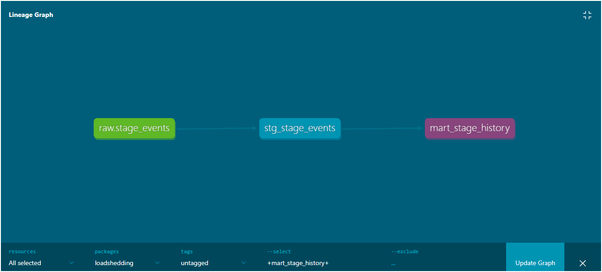

# 🔌 Load-Shedding Pipeline

A fully automated data pipeline that tracks South Africa's load-shedding stages in real time, transforms the data using dbt, and runs on a schedule using Prefect.

---

## 📌 What it does

- Extracts live load-shedding stage data from the [EskomSePush API](https://eskomsepush.gumroad.com/l/api)
- Loads raw data into PostgreSQL preserving the original untouched response
- Transforms data through a staging and marts layer using dbt
- Runs data quality tests on every pipeline execution
- Orchestrated end-to-end with Prefect

---

## 🏗️ Architecture

EskomSePush API
↓
extract.py (Python)
↓
raw.stage_events (PostgreSQL)
↓
stg_stage_events (dbt staging view)
↓
mart_stage_history (dbt mart table)

---

## 📊 dbt Lineage Graph



---

## 🗂️ Project Structure

loadshedding-pipeline/
etl/
extract.py # Pulls from API, loads into raw schema
prefect_flow.py # Orchestrates the full pipeline
sql/
init_schema.sql # Creates raw schema and tables
loadshedding/ # dbt project
models/
staging/
stg_stage_events.sql
marts/
mart_stage_history.sql
macros/
generate_schema_name.sql
seeds/

---

## 🧱 Tech Stack

| Tool            | Purpose                          |
| --------------- | -------------------------------- |
| Python          | Extraction and loading           |
| PostgreSQL      | Data warehouse                   |
| dbt Core        | Transformations and data quality |
| Prefect         | Orchestration and scheduling     |
| EskomSePush API | Live load-shedding data source   |

---

## ⚙️ How to run

**1. Clone the repo and install dependencies**

```bash
git clone https://github.com/SikelelaSomp/Loadshedding-Pipeline.git
cd loadshedding-pipeline
pip install -r requirements.txt
```

**2. Set up environment variables**

```bash
cp .env.example .env
# Fill in your PostgreSQL credentials and EskomSePush API key
```

**3. Create the database schema**

```bash
psql -U postgres -d loadshedding_db -f sql/init_schema.sql
```

**4. Run the pipeline**

```bash
python etl/prefect_flow.py
```

**5. View dbt docs and lineage graph**

```bash
cd loadshedding
dbt docs generate
dbt docs serve
```

---

## 💡 Key concepts demonstrated

- **Idempotent loading** — pipeline can run multiple times without duplicating data
- **Raw vs staging layers** — raw preserves original data, staging cleans and casts
- **Window functions** — `LEAD()` calculates time spent at each load-shedding stage
- **Data quality tests** — dbt tests run automatically on every pipeline execution
- **Secrets management** — credentials stored in `.env`, never committed to GitHub
- **Orchestration** — Prefect wraps all tasks with retries and observability
